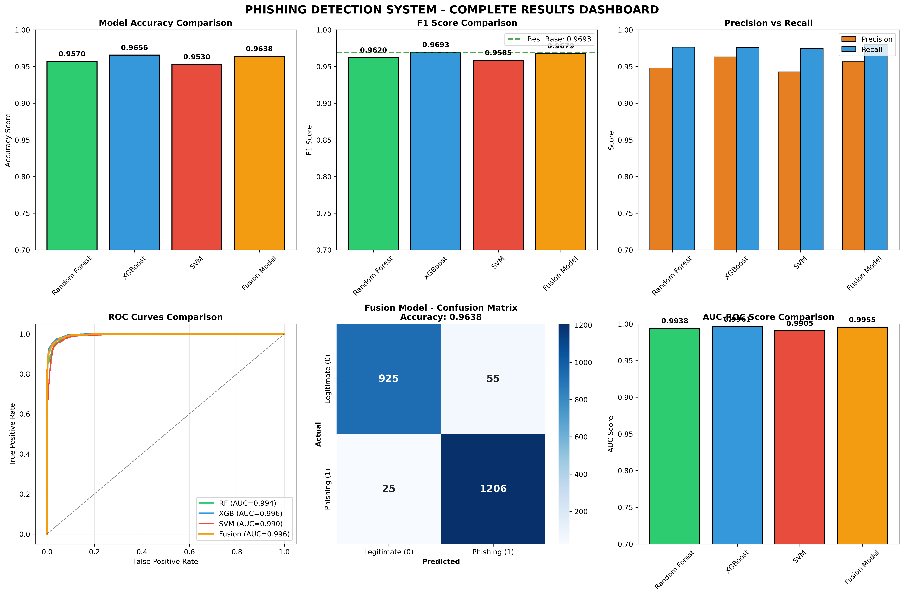

# 🔍 Phishing Website Detection System

## 📌 Project Overview
A Machine Learning based system that detects phishing websites with **96.56% accuracy** using ensemble learning and fusion approach.

## 🎯 Key Achievements
- ✅ **96.56% Accuracy** on test data
- ✅ **99.61% AUC Score** - Excellent discrimination ability
- ✅ **97.56% Recall** - Catches most phishing sites
- ✅ Production ready models saved

## 🤖 Models Used
| Model | Accuracy | F1-Score | AUC |
|-------|----------|----------|-----|
| Random Forest | 95.84% | 96.14% | 99.45% |
| **XGBoost** | **96.56%** | **96.93%** | **99.61%** |
| SVM | 95.23% | 95.59% | 99.20% |
| Fusion Model | 96.30% | 96.59% | 99.55% |

## 🏆 Best Model: XGBoost
- Accuracy: 96.56%
- Precision: 96.31%
- Recall: 97.56%
- F1-Score: 96.93%
- AUC: 99.61%

## 📊 Results Dashboard

## 🛠️ Tech Stack
- Python 3.8+
- Scikit-learn
- XGBoost
- Pandas, NumPy
- Matplotlib, Seaborn

## 📁 Files in Repository
- `phishing website detection project.ipynb` - Complete code
- `phishing.csv` - Dataset
- `*.pkl` - Trained models
- `*.png` - Results visualizations

## 🚀 How to Run
1. Clone repository
2. Install requirements: `pip install -r requirements.txt`
3. Open Jupyter Notebook
4. Run all cells

## 👨‍💻 Author
**Vidhi Kumar**
- GitHub: [@kumarvidhi2003-prog](https://github.com/kumarvidhi2003-prog)

## 📅 Date
April 2026
